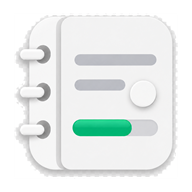

<div align="center">



# 가계부

**내 돈은 소중하니까.**

기간과 총액을 정하면 **오늘 얼마 쓸 수 있는지** 알려주는 가계부입니다.
여행 갈 때는 초대 코드 하나로 같이 가는 사람과 하나의 가계부를 함께 씁니다.

[**앱 열기 →**](https://halfcodz.github.io/save-my-wallet/)

</div>

---

## 무엇이 다른가

대부분의 가계부는 **얼마 썼는지**를 보여줍니다. 다 쓴 다음에야 알게 되죠.

이 앱은 **지금 얼마 더 써도 되는지**를 보여줍니다.
기간과 총액만 정해 두면 나머지는 앱이 알아서 다시 계산합니다.

<br>

## 홈 — 오늘 얼마 쓸 수 있나

```
 남은 금액
 445,000 원
 ████████░░░░░░░░░░░░░░░░░░░░░░
 155,000원 씀               600,000원

┌──────────────────────────────────────────┐
│  하루 사용 가능한 금액          120,000 원  │
├─────────────────────┬────────────────────┤
│  오늘 쓸 수 있는 돈   │  오늘 쓴 돈         │
│  85,000 원          │  35,000 원         │
└─────────────────────┴────────────────────┘
                              남은 기간 4일
```

숫자 셋이 각자 다른 질문에 답합니다.

| | 뜻 |
| --- | --- |
| **하루 사용 가능한 금액** | 앞으로 하루에 이만큼씩 쓰면 기간을 맞춘다 |
| **오늘 쓸 수 있는 돈** | 오늘 아직 이만큼 남았다 |
| **오늘 쓴 돈** | 오늘 실제로 나간 돈 |

- **오늘 쓸 수 있는 돈은 쓴 만큼 정확히 줄어듭니다.** 35,000원을 쓰면 35,000원 줄어듭니다.
  하루치 안에서 쓰는 동안은 하루치가 흔들리지 않아서, 기준이 되는 숫자가 하루 종일 같습니다.
- **넘기면 음수로 알려줍니다.** 하루치 120,000원인데 200,000원을 썼다면 `-80,000원`,
  게이지에는 빗금이 칩니다.
- **넘긴 순간 하루치도 같이 내려갑니다.** 위처럼 넘겨 쓰면 하루 사용 가능한 금액이
  그 자리에서 93,300원으로 떨어집니다. 남은 돈을 내일부터 남은 날로 다시 나눈 값입니다.
- **내려간 값은 다음 날 그대로 이어집니다.** 자정이 지나도 93,300원 그대로라,
  넘겨 쓴 만큼이 하루 지났다고 없던 일이 되지 않습니다.
- **아껴 쓰면 반대로 올라갑니다.** 오늘 덜 쓴 만큼이 남은 날의 하루치로 붙습니다.

기간이 끝나면 하루치 대신 `—`가 뜨고, 한도를 정하지 않은 가계부에서는 이 자리가
**하루 평균**으로 바뀝니다.

<br>

## 두 가지 가계부

**나의 가계부** — 평소 쓰는 것. 매달 1일에 저절로 새로 시작합니다.
한 달 한도를 정해 두면 위 계산이 돌아가고, 안 정하면 그냥 기록장이 됩니다.
달 단위가 안 맞으면 (월급날 기준 등) 기간을 직접 지정할 수도 있습니다.

**여행 예산** — 기간과 총액을 정해 두는 것. 여행이 끝나면 같이 끝납니다.
이쪽만 여러 명이 함께 쓸 수 있습니다.

둘은 상단 이름을 눌러 오갑니다. 여행 예산은 여러 개 만들어 둘 수 있습니다.

<br>

## 함께 쓰기와 정산

여행 가계부를 만든 사람이 **8자리 초대 코드**를 만들어 알려주면 끝입니다.
받은 사람은 로그인한 뒤 코드를 넣고 참여합니다.

이제 누가 얼마를 썼는지 **서로 실시간으로 보입니다.** 각자 자기 폰에서 자기가 쓴 걸 적으면 됩니다.

여행이 끝나면 **요약** 탭에서 **정산**을 봅니다.
누가 누구에게 얼마를 주면 똑같이 나눠 낸 게 되는지 알려줍니다.
많이 받을 사람과 많이 줄 사람을 큰 것부터 짝지어서 송금 횟수를 줄입니다.

- 코드가 새어 나갔으면 **코드 새로 만들기** — 이전 코드는 즉시 못 씁니다
- 더 부를 사람이 없으면 **초대 끄기** — 이미 들어온 사람은 그대로입니다
- 만든 사람만 멤버를 내보내거나 예산을 지울 수 있습니다

서로의 카테고리 목록이 달라도 상대 화면에서 제대로 보입니다.

<br>

## 내역 — 달력으로 먼저

내역 탭은 **달력**으로 엽니다. 어느 날 얼마를 썼는지 한눈에 보이고,
날짜를 누르면 그 칸이 카드로 자라나면서 그날이 펼쳐집니다.

카드 안에는 **홈 화면과 똑같은 상자**가 들어 있습니다.
그날 아침 기준으로 하루 사용 가능한 금액이 얼마였는지, 그래서 그날 얼마를 쓸 수 있었고
실제로 얼마를 썼는지를 그대로 되살려 보여줍니다.

```
 8월 21일 (금)

┌──────────────────────────────────────────┐
│  하루 사용 가능한 금액           63,600 원  │
├─────────────────────┬────────────────────┤
│  8/21에 쓸 수 있던 돈 │  8/21에 쓴 돈       │
│  43,600 원          │  20,000 원         │
└─────────────────────┴────────────────────┘
```

- 오른쪽 위 버튼으로 **리스트 보기**로 전환
- 지출을 **왼쪽으로 밀면 삭제** (손가락을 따라옵니다)
- **길게 눌러 여러 개 선택** 후 한 번에 삭제
- 카드 안에서 바로 고치거나 지울 수 있고, **이 날짜에 추가**로 그날 지출을 넣습니다

<br>

## 요약

- 예산 사용률 도넛
- **카테고리별** 지출 — 많이 쓴 순서
- 함께 쓰는 예산이면 **사람별** 지출과 **정산**

기본 카테고리 14개(🍚 식사 · 🍩 카페/간식 · 🍺 술 · 🚌 교통 · ⛽ 주유 · 🛏 숙박 · 🎟 입장료/관광 · 🛍 쇼핑 · 🧻 생필품 · 💊 의료 · 📱 통신/구독 · 🎮 취미/여가 · 🎁 선물 · ✏️ 기타)로 시작하고, 메뉴에서 이름·이모지를 고치거나 새로 만들 수 있습니다.

<br>

## 손에 붙는 것들

**홈 화면에 추가하면 앱이 됩니다.** 사파리에서 공유 → 홈 화면에 추가.
주소창 없이 전체 화면으로 뜨고, 아이폰 다이나믹 아일랜드 자리까지 테마 색이 이어집니다.

**인터넷이 끊겨도 열립니다.** 앱 파일은 캐시에, 데이터는 로컬에 있습니다.
오프라인에서 적은 내역은 연결되면 알아서 올라갑니다.

**당겨서 새로고침.** 홈 화면 웹앱에는 새로고침 버튼이 없어서, 화면을 위에서 아래로 당깁니다.
밀린 데이터를 맞추고, 새 버전이 나왔는지도 함께 확인합니다.

**다크 모드.** 메뉴에서 전환합니다. 첫 페인트 전에 테마를 읽어서 열 때 흰 화면이 번쩍하지 않습니다.

**군더더기 없이.** 지출을 넣고 고치고 지울 때 "저장했습니다" 같은 알림이 뜨지 않습니다.
화면의 숫자가 바로 바뀌는 것으로 충분하니까요.

<br>
